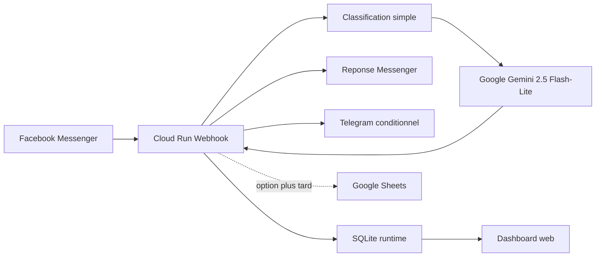

# Architecture

## Composants

- Messenger : canal entrant client
- Cloud Run : point d'entree public
- Gemini : moteur de reponse direct
- Telegram : alertes internes seulement si besoin
- SQLite : journalisation locale de runtime
- Dashboard : suivi simple de l'activite

## Endpoints principaux

- `GET /health`
- `GET /dashboard`
- `GET /webhook/facebook`
- `POST /webhook/facebook`

## Fichiers techniques

- [app.py](D:/Travail/RAM'S%20FLARE/Flare%20Group/Flare%20AI/Antigravity/FLARE%20AI%20OS/V2/chatbot%20Facebook/direct_service/app.py)
- [Dockerfile](D:/Travail/RAM'S%20FLARE/Flare%20Group/Flare%20AI/Antigravity/FLARE%20AI%20OS/V2/chatbot%20Facebook/direct_service/Dockerfile)
- [requirements.txt](D:/Travail/RAM'S%20FLARE/Flare%20Group/Flare%20AI/Antigravity/FLARE%20AI%20OS/V2/chatbot%20Facebook/direct_service/requirements.txt)
